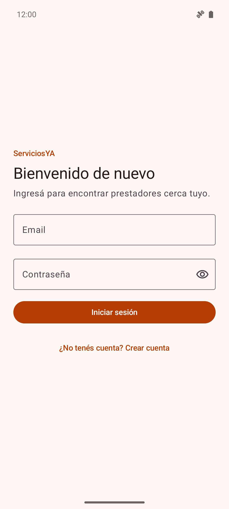
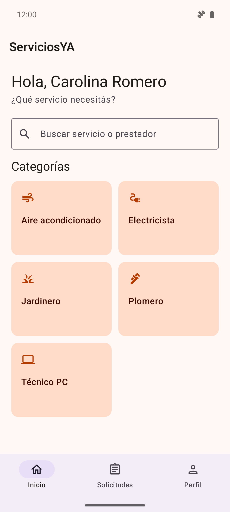
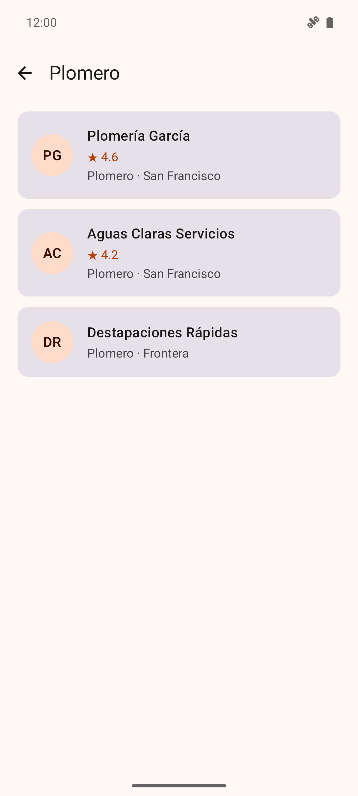
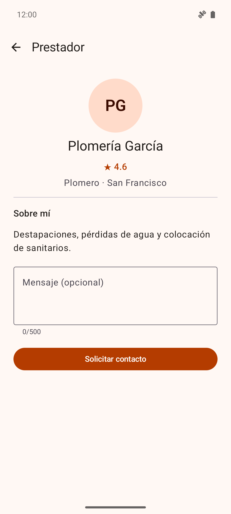
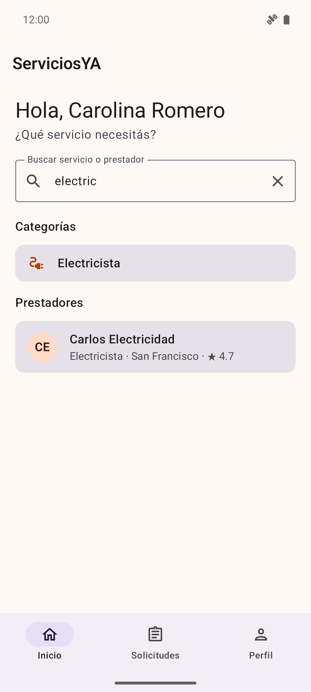
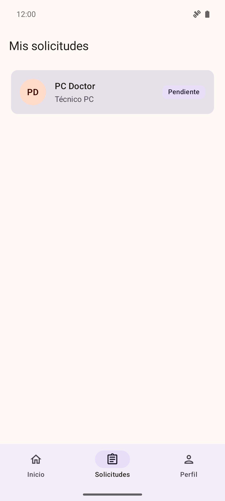
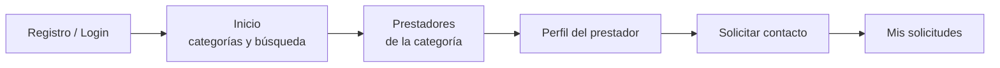

# ServiciosYA

**Encontrá un prestador de tu ciudad por rubro y pedile contacto en pocos toques.**

-3DDC84?logo=android&logoColor=white)


ServiciosYA es una app Android que conecta a personas que necesitan resolver un trabajo puntual en su casa (un enchufe que no anda, una pérdida de agua, un aire acondicionado que no enfría) con prestadores de servicios de su ciudad.

Hoy encontrar a alguien confiable depende del boca en boca, de grupos de WhatsApp o de buscar en redes. Esa búsqueda es lenta, no deja registro y no permite comparar. ServiciosYA reúne a los prestadores por rubro, muestra su calificación y permite pedirles contacto desde la app.

> Proyecto desarrollado para el **Trabajo Práctico 2 de Arquitecturas Móviles 2026** (UTN – Facultad Regional San Francisco): aplicación del ciclo **Build-Measure-Learn** de *Lean Mobile App Development*.

## Capturas

| Inicio de sesión | Categorías | Prestadores |
|:---:|:---:|:---:|
|  |  |  |
| **Perfil del prestador** | **Búsqueda** | **Mis solicitudes** |
|  |  |  |

## Funcionalidades

- **Cuenta de usuario:** registro, inicio de sesión y cierre de sesión con email y contraseña. La sesión queda guardada, así que al volver a abrir la app se entra directo.
- **Categorías:** Electricista, Plomero, Aire acondicionado, Técnico PC y Jardinero.
- **Prestadores por rubro:** listado ordenado por calificación, con ciudad y rating.
- **Perfil del prestador:** descripción del servicio, calificación y ciudad.
- **Solicitud de contacto:** con un mensaje opcional de hasta 500 caracteres. La app evita que se envíe dos veces por un doble toque.
- **Mis solicitudes:** el historial de pedidos con su estado.
- **Búsqueda:** por nombre de categoría o de prestador, sin importar tildes ni mayúsculas.
- **Navegación inferior:** Inicio, Solicitudes y Perfil.
- **Mensajes claros en español:** validaciones de formularios, errores de conexión y estados vacíos, con opción de reintentar.
- **Privacidad:** cada usuario ve solo sus propias solicitudes. Lo garantizan las reglas de seguridad de Firestore, no solo la app.
- **Medición:** eventos de Google Analytics en cada paso del recorrido (`category_view`, `provider_view`, `contact_request` y `service_search`).

## Cómo funciona



## Tecnologías

| Área | Herramientas |
|---|---|
| App | Kotlin, Jetpack Compose, Material 3, Navigation Compose |
| Estado y asincronía | ViewModel, StateFlow, Kotlin Coroutines |
| Backend | Firebase Authentication, Cloud Firestore, Google Analytics (Firebase BoM 33.16.0) |
| Seguridad | Firestore Security Rules, versionadas y con tests |
| Herramientas | Node.js con el Firebase Admin SDK (seed, reglas y métricas) y Python (simulación de usuarios) |
| Testing | JUnit 4, kotlinx-coroutines-test, emuladores de Firebase, `@firebase/rules-unit-testing` |

## Arquitectura

La app está organizada en capas, y la interfaz nunca accede directamente a Firebase:

```
Pantallas Compose → ViewModels → Casos de uso → Repositorios (interfaces) ← Implementaciones con Firebase
```

- Los repositorios se definen como interfaces en el dominio. Así los ViewModels y casos de uso se prueban con repositorios falsos.
- `AppContainer` arma las dependencias. Si no encuentra la configuración de Firebase, usa implementaciones alternativas: la app compila igual y muestra un aviso de configuración en vez de fallar.
- Los errores de Firebase se traducen en la capa de datos a mensajes en español.

El detalle completo, con el modelo de datos y la arquitectura propuesta para la próxima iteración, está en [`docs/ARQUITECTURA.md`](docs/ARQUITECTURA.md).

## Estructura del repositorio

```
ServiciosYA/
├── app/                    App Android
│   └── src/
│       ├── main/           Código (presentation, domain, data, di, navigation)
│       ├── test/           Tests unitarios
│       └── androidTest/    Tests de repositorios contra los emuladores de Firebase
├── docs/                   Entregables del TP2 y documentación técnica
├── tools/
│   ├── seed/               Carga de categorías y prestadores de prueba
│   ├── firestore-rules/    Tests y publicación de las reglas de seguridad
│   ├── metrics/            Métricas de uso a partir de Firestore
│   └── simulation/         Simulación de usuarios sobre la app real
├── firestore.rules         Reglas de seguridad de Firestore
└── FIREBASE_SETUP.md       Cómo conectar la app a un proyecto de Firebase
```

## Cómo ejecutarla

### Requisitos

- Android Studio y un dispositivo o emulador con **Android 7.0 (API 24) o superior**.
- **JDK 21** para Gradle (*Settings → Build Tools → Gradle → Gradle JDK*). El JDK 25 que trae Android Studio no es compatible con Gradle 8.13.
- **Node.js 22 o superior**, solo para las herramientas de `tools/`.

### Pasos

1. Clonar el repositorio:
   ```bash
   git clone https://github.com/Gon-nazz19/ServiciosYA.git
   ```
2. Conectar la app a un proyecto de Firebase y colocar `app/google-services.json` (ver [`FIREBASE_SETUP.md`](FIREBASE_SETUP.md)). Este archivo no está en el repositorio. Sin él la app compila, pero muestra un aviso de que no está configurada.
3. Cargar las categorías y los prestadores de prueba con [`tools/seed`](tools/seed/README.md).
4. Publicar las reglas de seguridad con [`tools/firestore-rules`](tools/firestore-rules/README.md).
5. Abrir el proyecto en Android Studio y ejecutarlo con *Run*, o desde la terminal:
   ```bash
   ./gradlew installDebug
   ```

## Tests

| Nivel | Qué cubre | Comando |
|---|---|---|
| Unitarios | ViewModels, casos de uso, validaciones, mapeos y navegación | `./gradlew testDebugUnitTest` |
| Reglas de Firestore | Qué puede leer y escribir cada usuario | `cd tools/firestore-rules && npm test` |
| Repositorios | Repositorios reales contra los emuladores de Auth y Firestore | `cd tools/firestore-rules && npm run test:android` |
| Manual | Flujo completo en la app | Checklist en [`docs/TESTING.md`](docs/TESTING.md) |

Los tests de reglas y de repositorios usan los emuladores locales de Firebase con un proyecto `demo-`, así que nunca tocan la base real.

## Resultados del MVP

La etapa de medición se hizo con una **simulación de 25 usuarios** que manejan la app real en el emulador, una alternativa que habilitó la cátedra. El 80 % de los usuarios simulados envió una solicitud de contacto, y los eventos de Analytics coincidieron uno a uno con las acciones realizadas. Como el comportamiento lo definen perfiles armados por el equipo, ese número es optimista y **no valida el mercado**.

La decisión fue **perseverar**: repetir la prueba con personas reales y, en la próxima iteración, cerrar el circuito para que la solicitud le llegue al prestador. El análisis completo está en [`docs/RESULTADOS.md`](docs/RESULTADOS.md).

## Próximos pasos

- **Modo prestador:** alta de perfil y bandeja para aceptar o rechazar solicitudes.
- **Notificaciones push** al prestador cuando recibe una solicitud y al cliente cuando se la aceptan.
- **Búsquedas sin resultado:** registrarlas y ofrecer "avisame cuando haya" para decidir qué rubros sumar.
- **Reseñas reales**, y disponibilidad y rotación en el listado, para que la demanda no se concentre siempre en los mismos prestadores.

## Documentación

| Documento | Contenido |
|---|---|
| [`docs/MVP.md`](docs/MVP.md) | Definición del MVP: problema, hipótesis, alcance y métricas de éxito |
| [`docs/RESULTADOS.md`](docs/RESULTADOS.md) | Resultados de la prueba, hallazgos y decisión de pivotar o perseverar |
| [`docs/ARQUITECTURA.md`](docs/ARQUITECTURA.md) | Arquitectura actual, modelo de datos y arquitectura actualizada |
| [`docs/PRUEBA_USUARIOS.md`](docs/PRUEBA_USUARIOS.md) | Protocolo para la prueba con usuarios reales |
| [`docs/TESTING.md`](docs/TESTING.md) | Estrategia de testing y checklist de prueba manual |
| [`FIREBASE_SETUP.md`](FIREBASE_SETUP.md) | Configuración de Firebase |
| [`tools/seed`](tools/seed/README.md) · [`tools/firestore-rules`](tools/firestore-rules/README.md) · [`tools/metrics`](tools/metrics/README.md) · [`tools/simulation`](tools/simulation/README.md) | Herramientas de soporte |

## Autores

- **Osvaldo Exequiel Barcos**
- **Gonzalo Nazzetta** ([@Gon-nazz19](https://github.com/Gon-nazz19))

Arquitecturas Móviles 2026 — UTN, Facultad Regional San Francisco.
