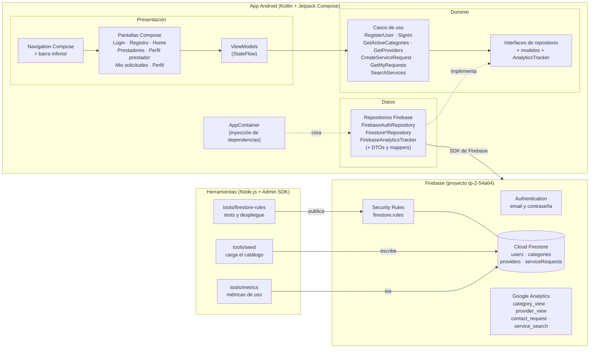
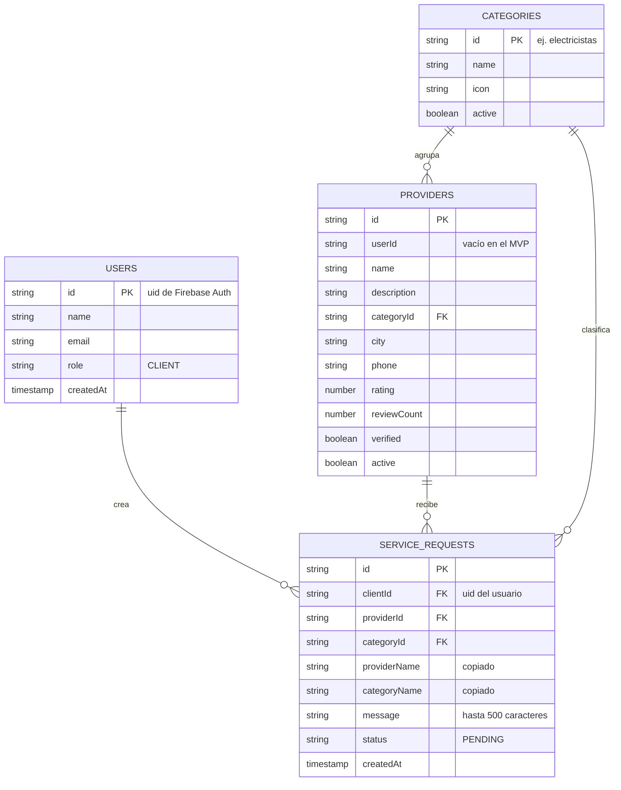
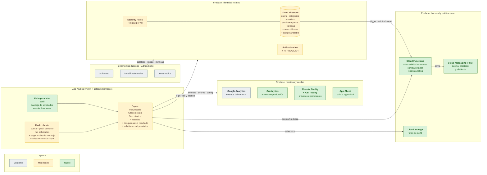
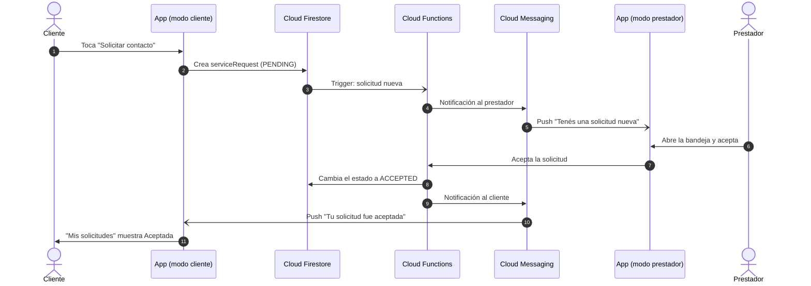
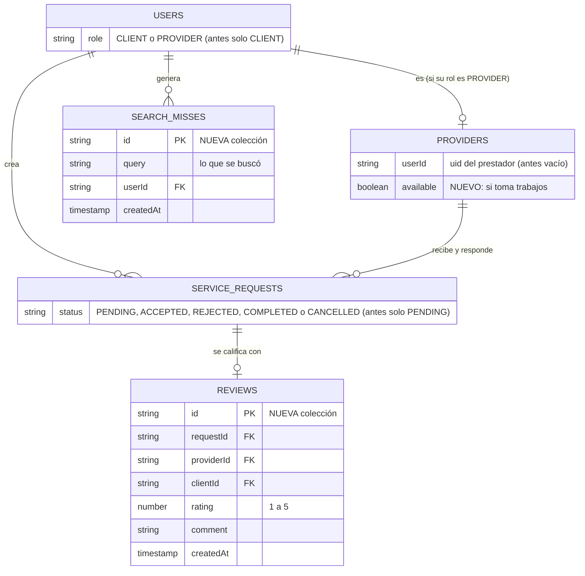
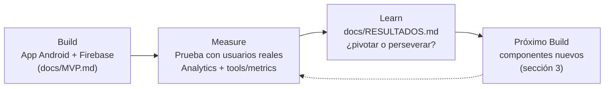

# Arquitectura — ServiciosYa

> Entregable 4 del TP2: arquitectura del MVP y versión actualizada según los resultados de la prueba.

## 1. Arquitectura actual (MVP)

La app sigue una arquitectura en capas: la UI **nunca** accede directamente a Firebase. Cada capa depende solo de la siguiente, y los repositorios se definen como interfaces en el dominio.

### Decisiones principales

| Decisión | Motivo |
|---|---|
| Capas UI → ViewModel → UseCase → Repository | La UI no depende de Firebase: se puede testear con repositorios falsos y cambiar de backend sin tocar pantallas |
| Errores de Firebase traducidos en la capa de datos (`AuthException`) | Mensajes claros en español y dominio independiente de Firebase |
| Nombres de prestador y categoría copiados en cada solicitud | "Mis solicitudes" se carga con una sola consulta |
| Orden de solicitudes en el cliente | Evita crear un índice compuesto en Firestore |
| Búsqueda en el cliente sobre los prestadores activos | Firestore no soporta búsqueda por texto; alcanza para unos 15 prestadores |
| Catálogo cargado con un seed (Admin SDK) | Valida la demanda sin construir todavía el alta de prestadores |
| Security Rules versionadas y testeadas | Cada usuario solo lee y crea sus propios datos |

## 2. Modelo de datos (Cloud Firestore)

## 3. Arquitectura actualizada

Es la arquitectura **completa** que proponemos para la próxima iteración. Parte de la [arquitectura actual](#1-arquitectura-actual-mvp) y le suma lo que surgió de los [hallazgos de la prueba](RESULTADOS.md#4-hallazgos). Cada caja tiene un color según su estado:

- ⬜ **Existente**: ya está implementado y no cambia.
- 🟨 **Modificado**: ya existe, pero hay que ampliarlo. Lo que se agrega aparece con un **+**.
- 🟩 **Nuevo**: todavía no existe.

> **Es una propuesta: nada de esta sección está implementado todavía.** Lo único que se aplicó de la prueba fue **H1**, el teclado que tapaba "Solicitar contacto", que se corrigió en la app sin agregar componentes.

### 3.1 Vista general

Las herramientas y Google Analytics no cambian. El cambio principal es que la app pasa a tener dos modos y que Firebase suma un backend propio (Cloud Functions + Cloud Messaging) para que la solicitud le llegue al prestador.

### 3.2 Flujo nuevo: la solicitud le llega al prestador

Hoy la solicitud queda guardada en Firestore y nadie la recibe (**H4**). Con los componentes nuevos, el circuito se cierra así:

Las Cloud Functions cambian el estado y envían las notificaciones del lado del servidor. Así la app del prestador nunca necesita permisos para escribir solicitudes de otros usuarios.

### 3.3 Cambios en el modelo de datos

Solo se muestra lo que cambia respecto del [modelo actual](#2-modelo-de-datos-cloud-firestore). La colección `categories` y el resto de los campos quedan igual.

### 3.4 Justificación de cada componente

Cada componente se justifica con un hallazgo de la [prueba simulada](RESULTADOS.md#4-hallazgos) (H1 a H6). Los que no tienen un hallazgo que los respalde quedan con prioridad baja.

| Componente | Tipo | Para qué | Hallazgo que lo motiva | Prioridad |
|---|---|---|---|---|
| **Modo prestador** (perfil y bandeja de solicitudes), con el rol PROVIDER en Authentication y reglas por rol | 🟩 Nuevo | Que la solicitud le llegue a alguien y pueda aceptarla o rechazarla. `providers.userId` y `users.role` ya están preparados | **H4**: el 70 % de los que pidieron contacto volvió a mirar su solicitud, pero queda *Pendiente* para siempre | **Alta** |
| **Cloud Functions** | 🟩 Nuevo | Al crearse una solicitud, notificar al prestador y manejar los cambios de estado sin darle a la app permisos sobre datos ajenos | **H4** | **Alta** |
| **Cloud Messaging (FCM)** | 🟩 Nuevo | Aviso push al prestador (solicitud nueva) y al cliente (solicitud aceptada) | **H4** | **Alta** |
| **Registro de búsquedas sin resultado** (colección `searchMisses`) + "avisame cuando haya" en el modo cliente | 🟩 Nuevo · 🟨 Modificado | Saber qué servicios pide la gente y todavía no ofrecemos | **H3**: 2 de 4 búsquedas buscaron servicios inexistentes (herrero, albañil) | Media |
| **Disponibilidad y rotación** en el listado (campo `available` y orden mixto) | 🟨 Modificado | Que la demanda no se concentre siempre en el primero | **H2**: 5 de 15 prestadores recibieron el 100 % de las solicitudes | Media |
| **Reseñas** (colección `reviews`) | 🟩 Nuevo | Dar confianza para decidir. El rating real reemplaza al del seed | H2 (el rating decide todo el tráfico, así que tiene que ser real) | Media |
| **Sugerencias de mensaje** en el modo cliente | 🟨 Modificado | Que el prestador reciba el pedido con contexto ("Urgente", "Presupuesto", "Instalación") | **H5**: el 50 % de las solicitudes llega sin mensaje | Media |
| **Remote Config + A/B Testing** | 🟩 Nuevo | Probar variantes, como las sugerencias de mensaje o el orden del listado, y medir cuál convierte más | **H5** | Media |
| **Crashlytics** | 🟩 Nuevo | Detectar crashes cuando la usen personas fuera del equipo | Preventivo: la simulación no tuvo crashes | Baja |
| **Cloud Storage** | 🟩 Nuevo | Fotos reales de prestadores | Sin evidencia todavía; validar en la prueba con personas | Baja |
| **App Check** | 🟩 Nuevo | Que solo la app oficial acceda a Firestore | Preventivo (seguridad) | Baja |

Ya aplicado en esta iteración: **H1**. El teclado tapaba "Solicitar contacto" y se corrigió en la app (manejo de teclado en Compose), sin componentes nuevos.

## 4. Cómo se relaciona con el ciclo Build-Measure-Learn

