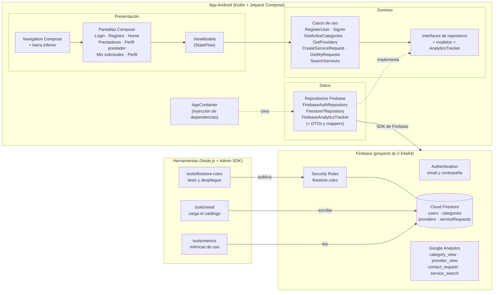
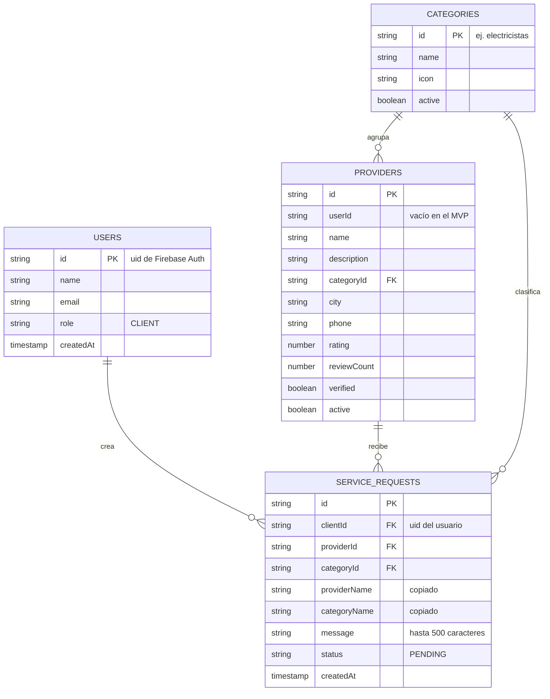
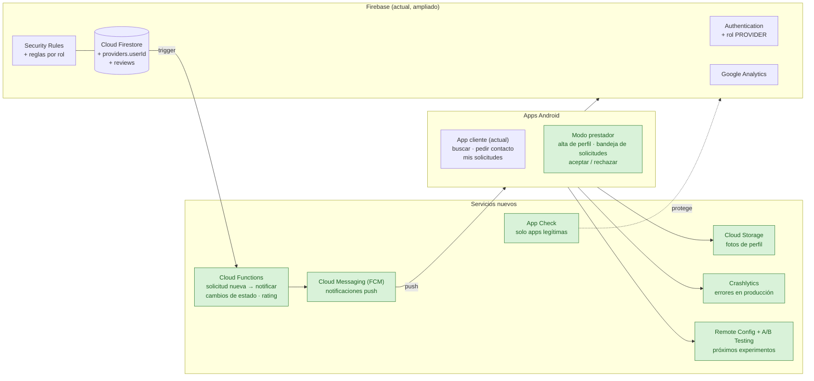
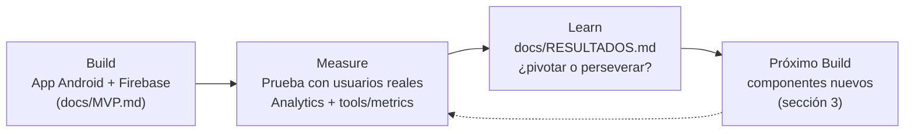

# Arquitectura — ServiciosYa

> Entregable 4 del TP2: arquitectura del MVP y versión actualizada según los resultados de la prueba.

## 1. Arquitectura actual (MVP)

La app sigue una arquitectura en capas: la UI **nunca** accede directamente a Firebase. Cada capa depende solo de la siguiente, y los repositorios se definen como interfaces en el dominio.

### Decisiones principales

| Decisión | Motivo |
|---|---|
| Capas UI → ViewModel → UseCase → Repository | La UI no depende de Firebase: se puede testear con repositorios falsos y cambiar de backend sin tocar pantallas |
| Errores de Firebase traducidos en la capa de datos (`AuthException`) | Mensajes claros en español y dominio independiente de Firebase |
| Nombres de prestador y categoría copiados en cada solicitud | "Mis solicitudes" se carga con una sola consulta |
| Orden de solicitudes en el cliente | Evita crear un índice compuesto en Firestore |
| Búsqueda en el cliente sobre los prestadores activos | Firestore no soporta búsqueda por texto; alcanza para unos 15 prestadores |
| Catálogo cargado con un seed (Admin SDK) | Valida la demanda sin construir todavía el alta de prestadores |
| Security Rules versionadas y testeadas | Cada usuario solo lee y crea sus propios datos |

## 2. Modelo de datos (Cloud Firestore)

## 3. Arquitectura actualizada

Componentes que habría que agregar para la siguiente iteración. Los que están en **verde** son nuevos.

### Justificación de cada componente

La columna **"Hallazgo que lo motiva"** se completa con los resultados reales ([`RESULTADOS.md`](RESULTADOS.md)). Si un componente no tiene un hallazgo que lo respalde, se posterga.

| Componente | Para qué | Hallazgo que lo motiva | Prioridad |
|---|---|---|---|
| **Modo prestador** (alta de perfil y bandeja de solicitudes) | Hoy las solicitudes no le llegan a nadie: el catálogo es ficticio. Es la Fase 2 del roadmap; `providers.userId` y `users.role` ya están preparados | _…_ | _…_ |
| **Cloud Functions** | Reaccionar a una solicitud nueva (notificar, cambiar estados) sin darle a la app permisos de escritura sobre datos ajenos | _…_ | _…_ |
| **Cloud Messaging (FCM)** | Avisar al prestador de una solicitud nueva y al cliente cuando se la aceptan | _…_ | _…_ |
| **Reseñas** (colección `reviews`) | Si los usuarios exploran pero no piden contacto, puede faltar confianza | _…_ | _…_ |
| **Cloud Storage** | Fotos reales de prestadores en lugar de iniciales | _…_ | _…_ |
| **Crashlytics** | Detectar crashes cuando la app la usen personas fuera del equipo | _…_ | _…_ |
| **Remote Config + A/B Testing** | Probar variantes (textos del botón, orden de prestadores) y medir cuál convierte más: el siguiente ciclo Build-Measure-Learn | _…_ | _…_ |
| **App Check** | Que solo la app oficial pueda leer y escribir Firestore | _…_ | _…_ |

## 4. Cómo se relaciona con el ciclo Build-Measure-Learn

