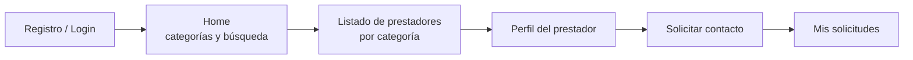

# Definición del MVP — ServiciosYa

> Entregable 1 del TP2 (Build-Measure-Learn).

## 1. Problema

Cuando alguien necesita resolver un trabajo puntual en su casa, como un enchufe que no anda, una pérdida de agua o un aire acondicionado que no enfría, encontrar un prestador confiable en su ciudad depende del boca en boca, de grupos de WhatsApp o de buscar en redes. Esa búsqueda es lenta, no deja registro y no permite comparar opciones.

## 2. Hipótesis a validar

> **Los usuarios utilizarán una aplicación móvil para encontrar prestadores locales y solicitar contacto cuando necesitan resolver un servicio puntual.**

Se descompone en dos supuestos que el MVP permite medir:

| Supuesto | Tipo | Cómo se mide |
|---|---|---|
| Las personas **buscan** prestadores por categoría dentro de una app | Valor | Vistas de categoría y de prestador (`category_view`, `provider_view`), búsquedas (`service_search`) |
| Después de ver un prestador, las personas **piden contacto** desde la app | Valor (conversión principal) | Solicitudes creadas (`contact_request`, colección `serviceRequests`) |

## 3. Usuario objetivo y propuesta de valor

- **Usuario:** personas de San Francisco (Córdoba) y alrededores que necesitan un servicio domiciliario puntual.
- **Propuesta de valor:** *"Encontrá un prestador de tu ciudad por rubro y pedile contacto en pocos toques."*
- **Categorías iniciales:** Electricista, Plomero, Aire acondicionado, Técnico PC, Jardinero.

## 4. Flujo principal del MVP

## 5. Alcance

### Incluido en el MVP

| Funcionalidad | Épica | Para qué sirve al experimento |
|---|---|---|
| Registro, login, sesión persistente y logout (Firebase Auth) | 1 | Identificar a cada usuario y sus solicitudes |
| Home con categorías desde Firestore | 2, 3 | Punto de entrada del embudo |
| Listado de prestadores por categoría | 5 | Paso "explorar" del embudo |
| Perfil del prestador | 6 | Paso "evaluar" del embudo |
| Solicitud de contacto | 7 | **Conversión principal** |
| Mis solicitudes | 8 | Confirmar al usuario que la solicitud quedó registrada |
| Navegación inferior (Inicio, Solicitudes, Perfil) | 9 | Usabilidad básica |
| Búsqueda de categorías y prestadores | 10 | Medir qué se busca y qué falta en el catálogo |
| Firebase Analytics | 11 | **Medir** el embudo |
| Datos de prueba (seed de 5 categorías y 15 prestadores) | 12 | Poder probar sin prestadores reales |
| Reglas de seguridad de Firestore | 13 | Cada usuario ve solo sus datos |
| Estados de pantalla y mensajes de error en español | 14 | Que los errores técnicos no distorsionen la prueba |
| Tests unitarios, de reglas, de repositorios y manual | 15 | Confianza en lo que se mide |

### Excluido a propósito

Todo lo que no ayuda a validar la hipótesis queda para iteraciones futuras:

| Fuera del MVP | Por qué no ahora |
|---|---|
| Alta de prestadores y panel del prestador | Se valida primero la **demanda** con un catálogo cargado a mano (seed) |
| Chat, presupuestos y agenda | La solicitud de contacto alcanza para medir intención |
| Pagos y comisiones | Monetizar no tiene sentido hasta validar el uso |
| Reseñas y ranking | El rating del seed alcanza para mostrar la idea |
| Mapas y geolocalización | En una sola ciudad no hace falta |
| Notificaciones push | Sin prestadores reales, no hay a quién notificar |

## 6. Métricas de éxito

Se definen **antes** de medir, para evaluar los resultados contra un criterio fijo y no acomodarlo después.

| Métrica | Fórmula | Fuente | Umbral para validar* |
|---|---|---|---|
| **Conversión a solicitud** | usuarios con ≥ 1 solicitud / usuarios registrados | Firestore (`tools/metrics`) | ≥ 30 % |
| Avance categoría → prestador | usuarios con `provider_view` / usuarios con `category_view` | Analytics | ≥ 60 % |
| Avance prestador → solicitud | usuarios con `contact_request` / usuarios con `provider_view` | Analytics | ≥ 30 % |
| Categorías más consultadas | ranking de solicitudes por categoría | Firestore | (descriptiva) |
| Búsquedas sin resultado | búsquedas que no encontraron nada / búsquedas totales | Observación + Analytics | ≤ 20 % |
| Satisfacción percibida | promedio de la pregunta "¿La usarías de nuevo?" (1–5) | Encuesta post-prueba | ≥ 4 |

\* *Umbrales propuestos por el equipo. Ajustarlos antes de la prueba si hace falta, nunca después.*

**Criterio de decisión:**
- Si la **conversión a solicitud** supera el umbral → **perseverar**: avanzar a la Fase 2 (prestadores reales).
- Si la gente explora pero no pide contacto → revisar confianza y perfil del prestador (reseñas, fotos, verificación) antes de avanzar.
- Si la gente ni siquiera explora → **pivotar** el enfoque: canal, propuesta o categorías.

## 7. Relación con el capítulo 6 de *Lean Mobile App Development*

> _Completar con los conceptos del capítulo 6 que usaron para definir este MVP, con cita y página. Por ejemplo, cómo eligieron qué dejar afuera o qué tipo de MVP es._

- _…_
- _…_

## 8. Del MVP al ciclo Build-Measure-Learn

| Etapa | En este proyecto |
|---|---|
| **Build** | App Android (Kotlin, Jetpack Compose) + Firebase Auth, Firestore y Analytics. Código en este repositorio |
| **Measure** | Prueba con usuarios reales ([`PRUEBA_USUARIOS.md`](PRUEBA_USUARIOS.md)), métricas de Firestore (`tools/metrics`) y eventos de Analytics |
| **Learn** | Análisis y decisión de pivotar o perseverar en [`RESULTADOS.md`](RESULTADOS.md). Cambios de arquitectura en [`ARQUITECTURA.md`](ARQUITECTURA.md) |
